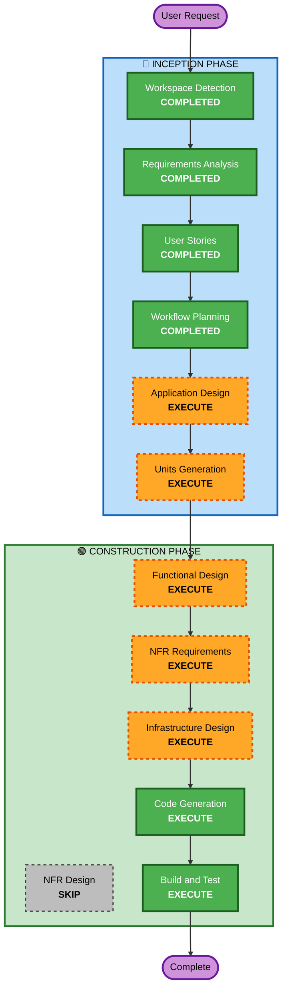

# Execution Plan

## Detailed Analysis Summary

### Change Impact Assessment
- **User-facing changes**: Yes — 7개 페르소나별 차등 응답, 풀 데모 UI
- **Structural changes**: Yes — 신규 시스템 전체 아키텍처 설계 필요
- **Data model changes**: Yes — 페르소나 프로파일, STM/LTM 스키마, CEDAR 정책
- **API changes**: Yes — 신규 API 전체 (화자 매핑, 페르소나 관리, 에이전트 대화)
- **NFR impact**: Yes — 실시간 처리 성능, 보안(SECURITY 전체), PBT

### Risk Assessment
- **Risk Level**: Medium-High
- **Rollback Complexity**: Easy (Greenfield, 롤백 = 이전 커밋)
- **Testing Complexity**: Complex (다중 페르소나 × 시나리오 조합, PBT 필수)
- **Critical Path**: Speaker Mapping → AgentCore Memory → Policy → Strands Agent

## Workflow Visualization

## Phases to Execute

### 🔵 INCEPTION PHASE
- [x] Workspace Detection (COMPLETED)
- [x] Requirements Analysis (COMPLETED)
- [x] User Stories (COMPLETED)
- [x] Workflow Planning (IN PROGRESS)
- [ ] Application Design - EXECUTE
  - **Rationale**: 신규 시스템, 컴포넌트 식별 및 서비스 레이어 설계 필요. Speaker Mapping, Orchestrator, Policy Enforcer 등 핵심 컴포넌트 간 관계 정의 필수.
- [ ] Units Generation - EXECUTE
  - **Rationale**: 다중 컴포넌트 시스템으로 병렬 개발 가능한 단위 분해 필요. Critical Path 기반 우선순위 설정.

### 🟢 CONSTRUCTION PHASE (Per-Unit)
- [ ] Functional Design - EXECUTE
  - **Rationale**: 화자 매핑 상태 머신, CEDAR 정책 규칙, 페르소나 분기 로직 등 복잡한 비즈니스 로직 상세 설계 필요. PBT-01 (Property Identification) 수행.
- [ ] NFR Requirements - EXECUTE
  - **Rationale**: 실시간 처리 성능(3초 이내), 보안(SECURITY 15개 규칙), PBT 프레임워크 선정 필요.
- [ ] NFR Design - SKIP
  - **Rationale**: NFR 패턴이 단순 (TLS, IAM, 구조화 로깅). 별도 설계 단계 없이 Code Generation에서 직접 반영 가능.
- [ ] Infrastructure Design - EXECUTE
  - **Rationale**: ECS Fargate + Lambda + Valkey + Transcribe + AgentCore 연동. 인프라 매핑 필요.
- [ ] Code Generation - EXECUTE (ALWAYS)
  - **Rationale**: 구현 필수.
- [ ] Build and Test - EXECUTE (ALWAYS)
  - **Rationale**: 빌드/테스트 지침 필수.

### 🟡 OPERATIONS PHASE
- [ ] Operations - PLACEHOLDER

## Success Criteria
- **Primary Goal**: S1, S3, S4, S7 시나리오 데모 시연 가능
- **Key Deliverables**: 
  - Speaker Mapping State Machine
  - Strands Agent + 페르소나 프롬프트 7종
  - AgentCore Memory/Policy 연동
  - React 풀 데모 UI
  - Transcribe Streaming 하이브리드 연동
- **Quality Gates**:
  - 모든 P0 스토리 AC 통과
  - SECURITY 규칙 compliance
  - PBT 테스트 통과 (Hypothesis + fast-check)
  - End-to-end 지연시간 3초 이내
